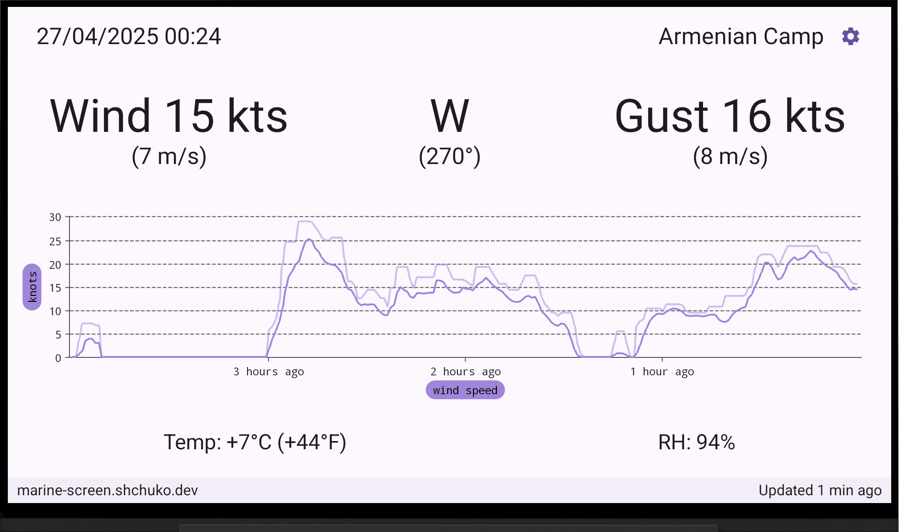

# Marine Screen

Marine Screen shows live weather data (current wind, gusts, direction, temperature, humidity) from
your weather station on your Android TV screen.

Currently, the only supported data source is WindGuru Station https://stations.windguru.cz/

You can assemble an [acurite-bridge](https://github.com/shchuko/acurite-bridge) to publish
your station measurements to WindGuru and other services.
